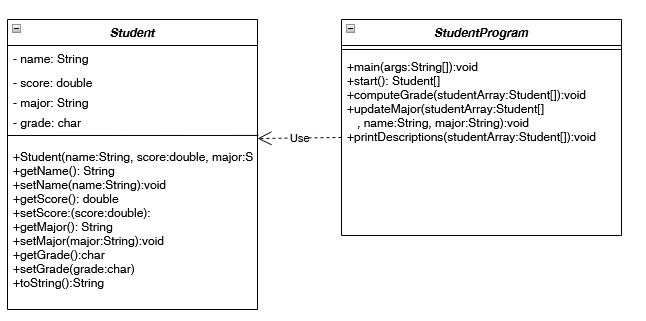
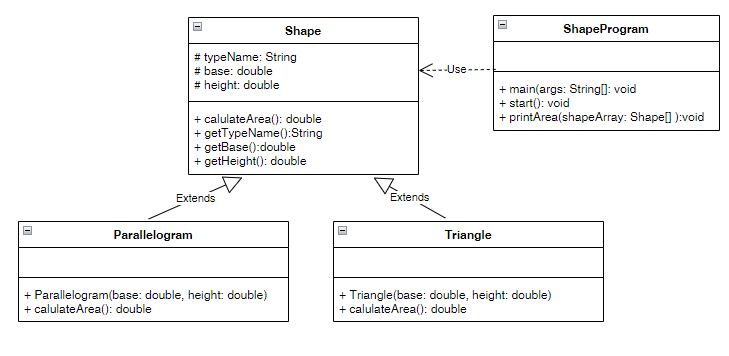

Midterm OODP 2/2022
===================

Before you start
----------
Please read the instruction carefully. The exam is composed of the contents of week 01 to week 05.
**You start this lab by cloning project and convert it to Maven project as you have done in the previous lab.**

Exam One - Student Program
--------------------------
The student program code can be found in the ​midterm.oodp.studentprogram. You have to complete the ​ Student class and StudentProgram class, and uncomment the marked lines (in TODO) program. The class diagram below presents the structure of 2 classes.



**Student** class should include
- 4 instance variables: name, major, score and grade
- A constructor so that _StudentProgram_ can create an object. For example,  _new Student("Peter", 85.55, "SE")_
- Accessors/Mutators for setting and getting the value of the 4 instance variables
- toString() method that return  string of student's info. For example,  _[Peter] is in major [SE] has score= [85.55] and grade= [A]_ 

**StudentProgram** class should include
- The method start() creates a student array filled with 4 students and return it. 
- The method computeGrade() takes the array of student object to compute grades by their scores
- The method updateMajor() takes the array of student object, name of student, and new major to update the major for student by his/her name. If the method cannot find the name of student it will return string, for example,   _Cannot find student name: [Alex]_ .  And if the method can find the student name, it will update the major and return string as  _[Molly]'s major is updated to CE_ .
- The method printDescriptions() takes the array of student object and display the student information. You must call the override method toString() in Student class. 
- The Main method, you have to  complete the method in TODO and  uncomment the marked lines(in TODO).

You may try to run Student Program, it should give the results as below.

```

===== Student Program =====
=====Student List=====
Peter is in major SE has score= 85.55 and grade= 
Molly is in major SE has score= 65.69 and grade= 
Nicky is in major MTA has score= 49.55 and grade= 
Justine is in major DBTI has score= 59.95 and grade= 
===== Compute Garde===== 
=====Student List=====
Peter is in major SE has score= 85.55 and grade= A
Molly is in major SE has score= 65.69 and grade= C
Nicky is in major MTA has score= 49.55 and grade= F
Justine is in major DBTI has score= 59.95 and grade= D
===== Update Major===== 
Cannot find student name: Alex
Molly's major is updated to CE
=====Student List=====
Peter is in major SE has score= 85.55 and grade= A
Molly is in major CE has score= 65.69 and grade= C
Nicky is in major MTA has score= 49.55 and grade= F
Justine is in major DBTI has score= 59.95 and grade= D
```

**Note**: This exam will be marked with **TestStudent.java**, please try to run and confirm the results with this test script.

Exam Two - Shape Program
--------------------------
The shape program code can be found in the **​midterm.oodp.shapeprogram **.
Write java program to compute the area of parallelogram and triangle as the class diagram below. 



You must finish the TODOs in  the following methods in the ​**Parallelogram** class.
- Create a constructor Parallelogram() for setting the initial value of base, height, and typeName as "Parallelogram"
- Override calulateArea() method for calculating the area of  Parallelogram as base * height (HINT: you can access base and height through this keyword)

You must finish the TODOs in the following methods in the **Triangle**​ class.
- Create a constructor Triangle() for setting the initial value of base, height, and typeName as "Triangle"
- Override calulateArea() method for calculating the area of  Triangle as (base * height)/2

You must finish the TODOs in the following methods in the **ShapeProgram** class.
- In start() method 
    - (a) declare and initialize an array of shape object called 'shapeArray' with the length of 2
    - (b) Populate the shapeArray with Parallelogram and Triangle, then pass the value 10 and 5 for the constructors parameters
- In printArea() Loop through all the shape in the given list, and print their details, for example,

    - _Shape type: [Parallelogram]_   
    - _base:[10.0], height:[5.0], area= [50.0]_


You may try to run Student Program. It should give the results as below.

```
Shape type:Parallelogram
base:10.0, height:5.0, area=50.0
--------------------------------------------------------------
Shape type:Triangle
base:10.0, height:5.0, area=25.0
--------------------------------------------------------------
```
**Note**: This exam will be marked with **TestShape.java**, please try to run and confirm the results with this test script.

Submit this exams
------------------
Don't forget to push your project to Github. Please make sure your project's classroom workflow is successfully executed.


